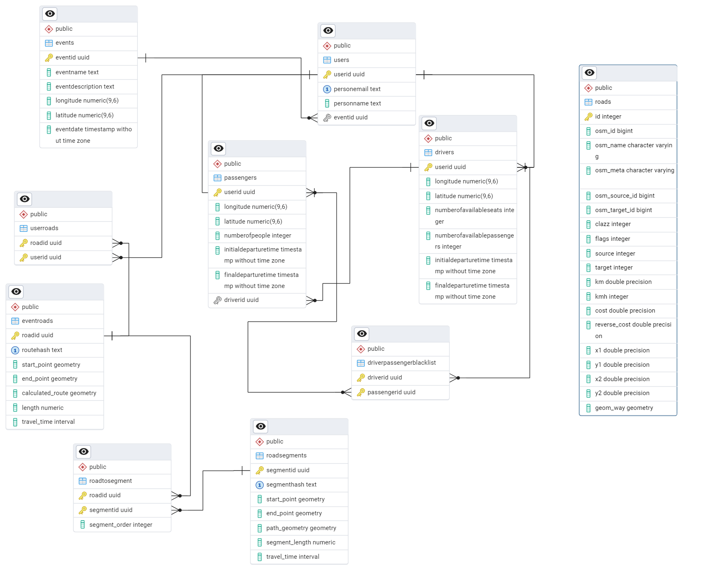

## Baza danych

Poniżej znajduje się opis bazy danych zaprojektowanej do obsługi aplikacji do rozwożenia uczestników wydarzeń. 

---
### Schemat

---

### Rozszerzenia
Baza danych wykorzystuje następujące rozszerzenia:
- **PostGIS**: Obsługa danych przestrzennych, takich jak punkty i linie.
- **pgRouting**: Algorytmy wyznaczania tras, np. Dijkstra, A*.
- **pgcrypto**: Generowanie UUID dla unikalnych identyfikatorów.

### **Tabele związane z wydarzeniami i użytkownikami**

#### **Tabela `Events`**
Reprezentuje wydarzenia, dla których organizowane są transporty.

| Kolumna         | Typ               | Opis                                            |
|------------------|-------------------|------------------------------------------------|
| `eventId`       | `UUID`           | Unikalny identyfikator wydarzenia.             |
| `eventName`     | `TEXT`           | Nazwa wydarzenia.                              |
| `eventDescription` | `TEXT`       | Opis wydarzenia (opcjonalny).                  |
| `longitude`     | `DECIMAL(9, 6)`  | Długość geograficzna miejsca wydarzenia.       |
| `latitude`      | `DECIMAL(9, 6)`  | Szerokość geograficzna miejsca wydarzenia.     |
| `eventDate`     | `TIMESTAMP`      | Data i czas wydarzenia.                        |

---

#### **Tabela `Users`**
Przechowuje dane użytkowników uczestniczących w wydarzeniach.

| Kolumna         | Typ               | Opis                                            |
|------------------|-------------------|------------------------------------------------|
| `userId`        | `UUID`           | Unikalny identyfikator użytkownika.            |
| `personEmail`   | `TEXT`           | Adres e-mail użytkownika (unikalny).           |
| `personName`    | `TEXT`           | Imię i nazwisko użytkownika.                   |
| `eventId`       | `UUID`           | ID wydarzenia, w którym uczestniczy użytkownik.|

### **Tabele kierowców i pasażerów**

#### **Tabela `Drivers`**
Reprezentuje kierowców i ich dane transportowe.

| Kolumna                  | Typ               | Opis                                            |
|---------------------------|-------------------|------------------------------------------------|
| `userId`                 | `UUID`           | ID użytkownika (klucz obcy do `Users`).        |
| `longitude`              | `DECIMAL(9, 6)`  | Długość geograficzna destynacji kierowcy.       |
| `latitude`               | `DECIMAL(9, 6)`  | Szerokość geograficzna destynacji kierowcy.     |
| `numberOfAvailableSeats` | `INT`            | Liczba dostępnych miejsc w pojeździe.         |
| `numberOfAvailablePassengers` | `INT`      | Liczba pasażerów obecnie w pojeździe.         |
| `initialDepartureTime`   | `TIMESTAMP`      | Początkowy czas wyjazdu.                      |
| `finalDepartureTime`     | `TIMESTAMP`      | Ostateczny czas wyjazdu.                      |

#### **Tabela `Passengers`**
Przechowuje dane pasażerów i ich preferencje transportowe.

| Kolumna                | Typ               | Opis                                            |
|-------------------------|-------------------|------------------------------------------------|
| `userId`              | `UUID`           | ID użytkownika (klucz obcy do `Users`).        |
| `longitude`           | `DECIMAL(9, 6)`  | Lokalizacja destynacji pasażera (długość geograficzna).   |
| `latitude`            | `DECIMAL(9, 6)`  | Lokalizacja destynacji pasażera (szerokość geograficzna). |
| `numberOfPeople`      | `INT`            | Liczba osób w grupie pasażera.                |
| `initialDepartureTime`| `TIMESTAMP`      | Preferowany czas wyjazdu początkowego.         |
| `finalDepartureTime`  | `TIMESTAMP`      | Preferowany czas wyjazdu końcowego.           |
| `driverId`            | `UUID`           | ID kierowcy (klucz obcy do `Drivers`).

#### **Tabela `DriverPassengerBlacklist`**
Lista relacji między kierowcami i pasażerami, które nie są akceptowane.

| Kolumna        | Typ      | Opis                                |
|-----------------|----------|-------------------------------------|
| `driverId`     | `UUID`   | ID kierowcy (klucz obcy do `Drivers`).|
| `passengerId`  | `UUID`   | ID pasażera (klucz obcy do `Passengers`).|
| **PRIMARY KEY** | (`driverId`, `passengerId`) | |

---

### **Tabele związane z trasami**

#### **Roads**
Tabela stworzona na potrzeby pgRouting. Używana do obliczania tras.

#### **Tabela `EventRoads`**
Przechowuje pełne trasy wygenerowane dla wydarzeń.

| Kolumna           | Typ                   | Opis                                  |
|--------------------|-----------------------|---------------------------------------|
| `roadId`          | `UUID`               | Unikalny identyfikator trasy.         |
| `start_point`     | `GEOMETRY(Point, 4326)` | Punkt początkowy trasy.              |
| `end_point`       | `GEOMETRY(Point, 4326)` | Punkt końcowy trasy.                 |
| `length`          | `DECIMAL`            | Długość trasy w kilometrach.          |

#### **Tabela `RoadSegments`**
Reprezentuje odcinki tras, które mogą być współdzielone między różnymi trasami.

| Kolumna           | Typ                   | Opis                                  |
|--------------------|-----------------------|---------------------------------------|
| `segmentId`       | `UUID`               | Unikalny identyfikator segmentu.      |
| `segmentHash`     | `TEXT`               | Hash zapewniający unikalność segmentu.|
| `start_point`     | `GEOMETRY(Point, 4326)` | Punkt początkowy segmentu.           |
| `end_point`       | `GEOMETRY(Point, 4326)` | Punkt końcowy segmentu.              |
| `path_geometry`   | `GEOMETRY(LineString, 4326)` | Geometria segmentu.           |
| `segment_length`  | `DECIMAL`            | Długość segmentu w kilometrach.       |

#### **Tabela `RoadToSegment`**
Mapowanie tras (`EventRoads`) na ich segmenty (`RoadSegments`).

| Kolumna         | Typ      | Opis                               |
|------------------|----------|------------------------------------|
| `roadId`        | `UUID`   | ID trasy (klucz obcy do `EventRoads`).|
| `segmentId`     | `UUID`   | ID segmentu (klucz obcy do `RoadSegments`).|
| `segment_order` | `INT`    | Kolejność segmentów w trasie.      |
| **PRIMARY KEY** | (`roadId`, `segmentId`) | |

#### **Tabela `UserRoads`**
Mapowanie użytkowników na przypisane im trasy.

| Kolumna     | Typ      | Opis                                |
|-------------|----------|-------------------------------------|
| `roadId`    | `UUID`   | ID trasy (klucz obcy do `EventRoads`). |
| `userId`    | `UUID`   | ID użytkownika (klucz obcy do `Users`).|
| **PRIMARY KEY** | (`roadId`, `userId`) | |

---

### Kluczowe cechy bazy danych
1. **Współdzielenie odcinków tras**: `RoadSegments` umożliwia wielokrotne wykorzystanie tego samego odcinka między różnymi trasami, co minimalizuje powtarzalne obliczenia.
2. **Modularność tras**: Tabela `RoadToSegment` pozwala na elastyczne definiowanie tras jako sekwencji segmentów.
3. **Elastyczność użytkowników**: Tabele `Drivers`, `Passengers` i `UserRoads` pozwalają na przypisywanie tras zarówno kierowcom, jak i pasażerom, przy jednoczesnym zachowaniu relacji między nimi.

### Relacje między tabelami

1. **Użytkownicy i wydarzenia**:
   - Użytkownicy (`Users`) są powiązani z wydarzeniami (`Events`) za pomocą `eventId`. Każdy użytkownik może uczestniczyć w jednym wydarzeniu, ale jedno wydarzenie może mieć wielu użytkowników.

2. **Kierowcy i pasażerowie**:
   - Kierowcy (`Drivers`) i pasażerowie (`Passengers`) są specjalizacją użytkowników (`Users`).
   - Pasażerowie mogą być przypisani do konkretnego kierowcy za pomocą `driverId`. Relacja ta jest opcjonalna, tzn. pasażer nie musi mieć przypisanego kierowcy.
   - Tabela `DriverPassengerBlacklist` umożliwia wzajemne blokowanie kierowców i pasażerów.

3. **Trasy i ich segmenty**:
   - Każda trasa (`EventRoads`) składa się z kilku segmentów (`RoadSegments`), które są fizycznymi odcinkami drogi. 
   - Trasy są powiązane z segmentami w tabeli `RoadToSegment`, gdzie przypisuje się segmenty do trasy w odpowiedniej kolejności (`segment_order`).
   - Użytkownicy (`Users`) mogą być przypisani do tras (`EventRoads`) za pomocą tabeli `UserRoads`.

4. **Blacklista**:
   - Kierowcy i pasażerowie mogą być wzajemnie blokowani za pomocą tabeli `DriverPassengerBlacklist`. Blokada ta uniemożliwia im wspólną podróż.
