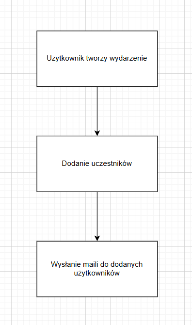
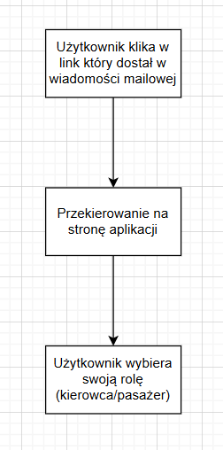
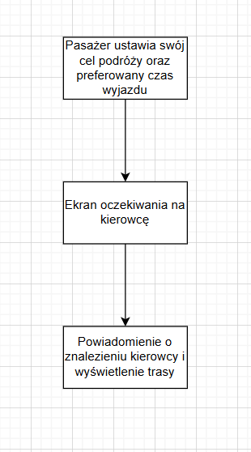
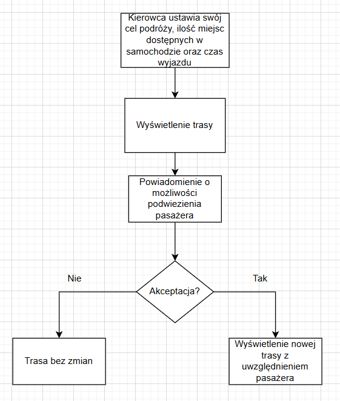
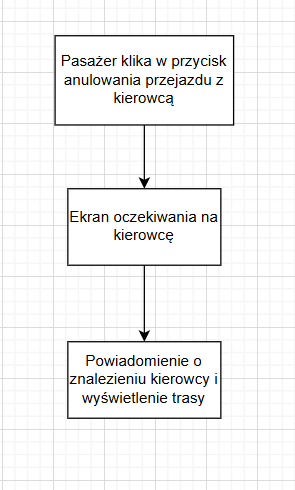
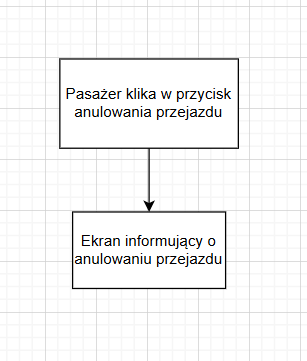
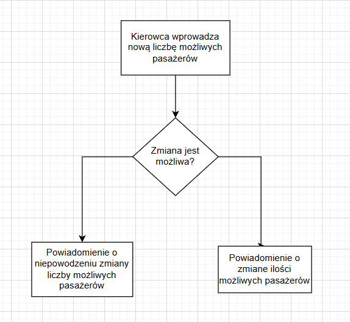

## Działanie aplikacji

#### Tworzenie wydarzenia

    

#### Inicjacja uczestnika

    

#### Rola pasażera

    

#### Rola kierowcy

    

#### Anulowanie przejazdu z aktualnym kierowcą przez pasażera

    

#### Całkowite anulowanie przejazdu przez pasażera

    

#### Zmniejszenie ilości możliwych pasażerów przez kierowcę

    

